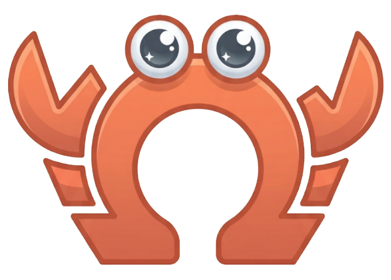

# OmegaClaw

<p align="center">
  
</p>


---

## Documentation

Full documentation lives in [`docs/`](./docs/README.md): introduction, tutorials, and API reference as a flat set of markdown files.

---

## Overview

OmegaClaw is a **hybrid agentic AI framework** implemented in MeTTa on OpenCog Hyperon. A large language model (LLM) works together with persistant memory in queryable format and formal logic engines — **NAL** and **PLN** — to remember its experiences, reason about the world, track uncertainty, combine evidence, and produce conclusions that are mathematically grounded rather than just plausible-sounding.

The core agent loop is approximately **200 lines of MeTTa**.

>Most AI assistants generate answers that sound right. OmegaClaw-hosted agents generate answers that come with a **mathematical receipt** showing exactly how confident each conclusion is and what evidence supports it. When the agent says it is 72% confident, that number comes from formal inference — not a feeling.

- OmegaClaw operates via a **continuous, stateful execution loop**, rather than a rigid stateless request-response model. By utilizing active memory "pins", the architecture allows the system to maintain a stable internal state and drive long-horizon, interleaved workflows without requiring a human prompt to trigger every step.
- Memory is stored as **knowledge graph that can reason**, not just retrieve. Rather than storing facts as flat text, AtomSpace structures knowledge as typed, relational atoms — meaning OmegaClaw can query its own memory symbolically, not just semantically. This is the difference between operating on a history of compressed context window, and reasoning over a web of meaning.
- Through direct access to its own execution traces and stored memories, OmegaClaw can observe and reflect on its own reasoning processes. This early-stage **metacognition** provides a level of structural transparency and self-auditing rarely found in standard agentic systems.

---

## What OmegaClaw does

- Runs a token-efficient agentic loop that receives messages, selects skills, and acts.
- Maintains a **three-tier memory** architecture (working, long-term, AtomSpace).
- Delegates reasoning to one of two formal engines, orchestrated by the LLM:
  - **NAL** — Non-Axiomatic Logic, symbolic inference under uncertainty.
  - **PLN** — Probabilistic Logic Networks, probabilistic higher-order reasoning.
  - ONA (OpenNARS for Applications) is a planned third engine but is **not installed by default** — see [reference-lib-ona.md](./reference-lib-ona.md) for the current experimental status.
- Exposes an extensible **skill system** covering memory, shell and file I/O, communication channels, web search, remote agents, and formal reasoning.

---

## The hybrid thesis

### Two kinds of reasoning, one pipeline

| Aspect | LLM (neural) | Formal engine (symbolic) |
|---|---|---|
| Natural language understanding | ✅ | ❌ |
| Premise formulation from text | ✅ | ❌ |
| Inference orchestration (which rule when) | ✅ | ❌ |
| Truth-value propagation | ❌ | ✅ |
| Confidence decay through chains | ❌ | ✅ |
| Formal contradiction detection | ❌ | ✅ |
| Auditable conclusion path | ❌ | ✅ |

The LLM turns ambiguous natural language into structured atoms with explicit truth values. The formal engine takes those atoms and applies rules whose truth-value arithmetic is deterministic and auditable.

When the agent outputs a conclusion, you can trace it back through every step: which premises fed into which rule, what truth value each premise carried, and what the math produced.

---

## Quick Start - IRC Channel

Requirement: Docker

OmegaClaw can be installed, started, and subsequently restarted with this single command:
```bash
curl -fsSL https://raw.githubusercontent.com/asi-alliance/OmegaClaw-Core/refs/heads/main/scripts/omegaclaw | bash -s -- singularitynet/omegaclaw:latest
```
OmegaClaw requires an LLM model to run. When prompted, please select from a list of supported models, enter an API key and a unique IRC channel name, then interact with your OmegaClaw at [webchat.quakenet.org](https://webchat.quakenet.org). 

### Channel authentication

At startup, the setup script prints a **one-time secret**.

To activate message handling, send this command in your channel exactly once:

```text
auth <one-time-secret>
```

The first user who sends the correct secret becomes the authenticated user.
All messages from other users are silently ignored. Your agent cannot be manipulated or controlled by other users, even if they enter your channel.

### Stopping, Restarting, Clearing Memory, Viewing Logs

When done interacting with your OmegaClaw, please use these commands as needed:

| Action | Command |
|--------|---------|
| Stop OmegaClaw | `docker stop omegaclaw` |
| View Logs | `docker logs -f omegaclaw` |
| Remove Containers | `docker rm -f omegaclaw` |
| Clear Memory | `docker volume rm omegaclaw-memory` |

To restart Omegaclaw simply rerun the single curl command show above. If there is an updated version of OmegaClaw, it will automatically be installed. When you restart OmegaClaw, you will receive a new authentication token secret to paste into your IRC channel chat for re-verification.

Your OmegaClaw will retain its memory for subsequent restarts unless you clear memory. To clear OmegaClaw memory and return to its initialized state, please run the command to stop OmegaClaw, the command to remove containers, the command to clear memory (all shown above), and then the single curl script command shown above.


